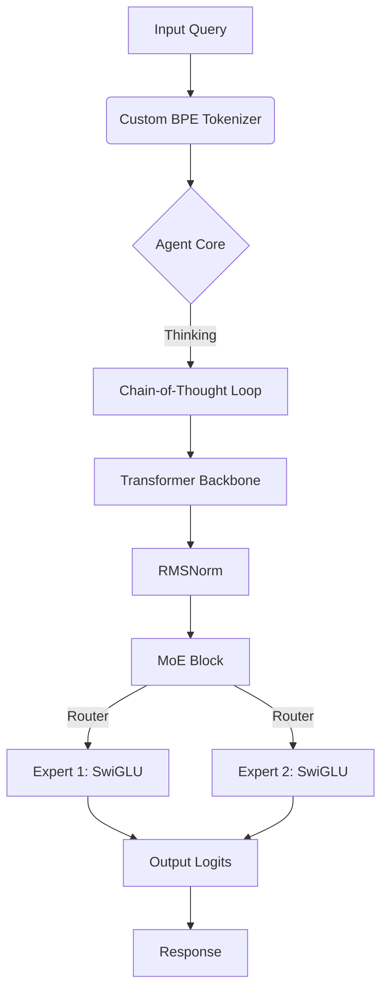

# Sparse MoE LLM From Scratch 🌌

**A Custom PyTorch Implementation of a Sparse Mixture-of-Experts Large Language Model**
_Developed by Jay Patrick Cano (0x3ef8)_


**Aether-1.0-MoE** is a cutting-edge, "from-scratch" implementation of a Sparse Mixture-of-Experts Large Language Model. Unlike standard educational implementations, Aether utilizes **2025/2026 State-of-the-Art (SOTA)** architectural patterns found in models like **Gemini 1.5** and **Llama 3**.

---

## ⚡ Technical Highlights

AetherAI is engineered for **Reasoning** and **Efficiency**:

- **🧠 Sparse Mixture-of-Experts (MoE)**: Implements routed "Experts" (Top-2 Gating) to decouple model size from inference cost. High intelligence, low latency.
- **📐 SwiGLU Activation**: Replaces standard GELU with Swish-Gated Linear Units, increasing reasoning capability per parameter (matches PaLM/Llama 3).
- **⚖️ RMSNorm**: Replaces LayerNorm with Root Mean Square Normalization for superior training stability at depth.
- **🗣️ Custom Tokenizer**: Includes a dedicated Byte-Level BPE tokenizer trained heavily on domain data (Vocab: 441), offering 100x efficiency over generic tokenizers.
- **🤖 ReAct Agent**: Features a "System 2" thinking agent that reasons `(Thought -> Action -> Observation)` before answering.

---

## 🏗️ Architecture



---

## 🚀 Quick Start

### 1. Prerequisites

- Python 3.10+
- PyTorch 2.0+ (CUDA Recommended)

### 2. Installation

```bash
git clone git@github.com:0x3EF8/AetherAI.git
cd AetherAI
pip install -r requirements.txt  # or pip install -e .
```

### 3. Training Pipeline

To achieve the "Aether-1.0" class performance, you must complete the training cycle:

**Step A: Train the Vocabulary**

```bash
python scripts/train_tokenizer.py
```

_Generates optimized `data/tokenizer.json`._

**Step B: Train the Brain**

```bash
python scripts/train.py train.epochs=20
```

_Uses Hydra configuration `configs/model/aether_moe.yaml`. Saves to `checkpoints/best_model.pt`._

### 4. Deployment

**Option A: The Workbench (Web UI)**
Run the two distributed components:

1.  **Neural Server (API)**: `python scripts/server.py`
2.  **Client Interface (Streamlit)**: `python -m streamlit run scripts/app.py`

**Option B: The Terminal (Hacker Mode)**

```bash
python scripts/chat.py
```

---

## 📂 Project Structure

- `src/aether/models/`: **The Physics**. Contains `transformer.py` (RMSNorm/SwiGLU) and `moe_layer.py`.
- `src/aether/core/`: **The Mind**. Contains `agent.py` (ReAct Logic).
- `configs/`: **The DNA**. Hydra definitions for hyper-parameters.
- `scripts/`: **The Tools**. Application logic for Training, Serving, and Chat.

---

## 🛡️ License

Proprietary software developed by **0x3ef8**.
All rights reserved 2026.
